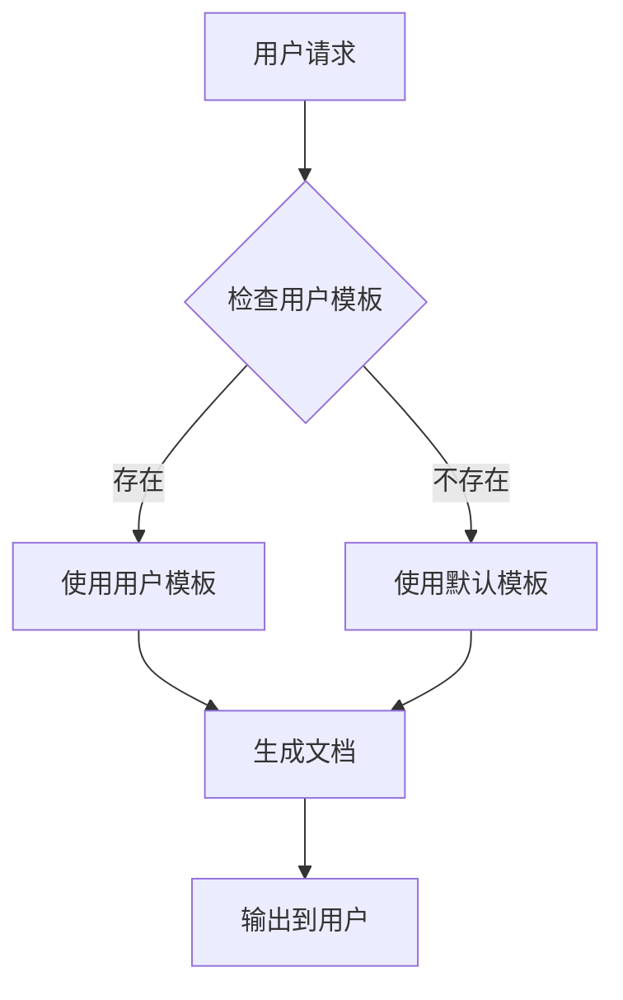

[根目录](../../CLAUDE.md) > **.spec-workflow**

# Spec Workflow 模块

> **模块职责**: 提供规格化工作流模板和文档生成工具
> **主要语言**: Markdown
> **模块类型**: 工作流模板系统

## 模块职责

Spec Workflow 模块为 OpenSkills 项目提供了一套完整的规格化文档模板系统，帮助开发团队：
- 标准化需求文档格式
- 统一设计和任务描述
- 管理产品和技术决策
- 支持自定义模板扩展

## 入口与启动

### 目录结构
```
.spec-workflow/
├── templates/              # 默认模板
│   ├── requirements-template.md  # 需求文档模板
│   ├── design-template.md       # 设计文档模板
│   ├── tasks-template.md        # 任务清单模板
│   ├── product-template.md      # 产品决策模板
│   ├── tech-template.md         # 技术决策模板
│   └── structure-template.md    # 结构决策模板
├── user-templates/         # 用户自定义模板
│   └── README.md         # 使用说明
├── memory.db             # 工作流数据存储
└── CLAUDE.md             # 本文档
```

### 模板加载优先级
1. **用户模板** (`.spec-workflow/user-templates/`)
2. **默认模板** (`.spec-workflow/templates/`)

## 对外接口

### 模板系统架构


### 支持的模板类型

#### 1. 需求文档 (requirements-template.md)
**用途**: 定义功能需求和技术要求
**包含部分**:
- 执行摘要
- 业务需求
- 技术需求
- 验收标准
- 时间线

#### 2. 设计文档 (design-template.md)
**用途**: 详细设计说明
**包含部分**:
- 架构概览
- 组件设计
- 接口定义
- 数据流
- 安全考虑

#### 3. 任务清单 (tasks-template.md)
**用途**: 任务分解和跟踪
**包含部分**:
- 任务列表
- 优先级排序
- 估算工时
- 依赖关系
- 完成状态

#### 4. 产品决策 (product-template.md)
**用途**: 产品方向和功能决策
**包含部分**:
- 问题陈述
- 解决方案
- 市场分析
- 用户反馈
- 成功指标

#### 5. 技术决策 (tech-template.md)
**用途**: 技术选型和架构决策
**包含部分**:
- 技术选项
- 对比分析
- 决策理由
- 实施计划
- 风险评估

#### 6. 结构决策 (structure-template.md)
**用途**: 项目结构和组织决策
**包含部分**:
- 目录结构
- 模块划分
- 命名规范
- 依赖管理
- 扩展性考虑

## 关键依赖与配置

### 模板变量系统
支持以下占位符变量：
- `{{projectName}}` - 项目名称
- `{{featureName}}` - 功能名称
- `{{date}}` - 当前日期
- `{{author}}` - 文档作者
- `{{version}}` - 版本号

### 数据存储
- **SQLite 数据库**: `memory.db`
- **存储内容**: 文档历史、版本信息、使用统计

### 集成点
与以下系统集成：
- OpenSkills CLI（未来计划）
- GitHub Issues/PR
- 项目管理工具
- 文档生成工具

## 使用流程

### 创建新文档
1. **选择模板类型**
   ```bash
   # 计划中的 CLI 命令
   openskills spec create requirements --name "新功能需求"
   ```

2. **填写模板内容**
   - 替换占位符变量
   - 填写具体内容
   - 添加项目特定信息

3. **生成最终文档**
   - 自动格式化
   - 添加元数据
   - 保存到指定位置

### 自定义模板
1. **创建用户模板**
   ```bash
   cp .spec-workflow/templates/requirements-template.md \
      .spec-workflow/user-templates/
   ```

2. **修改模板内容**
   - 调整结构
   - 添加自定义部分
   - 修改占位符

3. **测试模板**
   - 验证语法正确
   - 测试变量替换
   - 确保输出格式

## 最佳实践

### 模板设计原则
1. **结构清晰**: 使用层次化标题
2. **内容完整**: 覆盖所有必要方面
3. **易于定制**: 支持自定义扩展
4. **格式统一**: 保持一致性
5. **版本友好**: 易于追踪变更

### 文档编写指南
1. **使用 Markdown**: 确保兼容性
2. **添加目录**: 长文档包含 TOC
3. **使用表格**: 结构化信息
4. **包含代码块**: 示例和配置
5. **添加链接**: 相关文档引用

### 团队协作
1. **统一标准**: 全队使用相同模板
2. **定期更新**: 根据反馈改进
3. **版本控制**: 跟踪模板变更
4. **培训支持**: 确保正确使用

## 扩展功能

### 计划中的功能
1. **CLI 集成**
   ```bash
   openskills spec create <type> [options]
   openskills spec list
   openskills spec validate
   ```

2. **模板验证**
   - 语法检查
   - 必填字段验证
   - 格式规范检查

3. **自动化生成**
   - 从代码生成文档
   - 从注释生成规格
   - 批量文档更新

4. **集成工具**
   - VS Code 扩展
   - GitHub Actions
   - CI/CD 集成

### 高级特性
1. **模板继承**: 支持基础模板和特化
2. **条件内容**: 根据条件包含部分
3. **循环生成**: 批量创建相似文档
4. **多语言支持**: 国际化模板

## 配置文件

### 模板配置示例
```yaml
# .spec-workflow/config.yml
templates:
  requirements:
    file: requirements-template.md
    required: true
    variables:
      - projectName
      - featureName
      - author

  design:
    file: design-template.md
    dependsOn: requirements
    validation:
      - hasArchitecture
      - hasInterfaces
```

### 用户配置
```yaml
# .spec-workflow/user-config.yml
author: "Your Name"
defaultTemplate: requirements
outputDir: "./specs"
autoVersion: true
```

## 示例用法

### 创建需求文档
```markdown
# 用户认证功能需求

## 执行摘要
实现用户登录和注册功能...

## 业务需求
### 1. 用户注册
- 邮箱验证
- 密码强度要求
- 用户条款同意

### 2. 用户登录
- 记住登录状态
- 密码重置
- 多设备支持
```

### 自定义模板示例
```markdown
# API 设计模板

## 接口信息
- **名称**: {{apiName}}
- **版本**: {{version}}
- **作者**: {{author}}
- **日期**: {{date}}

## 端点定义
### {{endpoint}}
- **方法**: {{method}}
- **路径**: {{path}}
- **认证**: {{authType}}
```

## 维护和更新

### 模板维护
1. **定期审查**: 每季度评估模板有效性
2. **收集反馈**: 从用户收集改进建议
3. **版本管理**: 使用语义化版本控制
4. **文档更新**: 保持模板文档同步

### 质量保证
1. **测试覆盖**: 为模板功能编写测试
2. **CI 验证**: 自动化模板验证
3. **用户测试**: 新版本内部测试
4. **回滚机制**: 支持模板版本回退

## 相关文件清单

### 默认模板
- `templates/requirements-template.md` - 需求文档
- `templates/design-template.md` - 设计文档
- `templates/tasks-template.md` - 任务清单
- `templates/product-template.md` - 产品决策
- `templates/tech-template.md` - 技术决策
- `templates/structure-template.md` - 结构决策

### 用户文档
- `user-templates/README.md` - 使用说明
- `user-templates/*` - 用户自定义模板

### 数据文件
- `memory.db` - SQLite 数据存储

## 变更记录 (Changelog)

### 2025-12-07 10:21:32
- ✨ 创建 .spec-workflow 模块文档
- 📝 文档化所有模板类型
- 🎯 制定扩展和集成计划
- 🔧 提供使用最佳实践

---

*提示：规格化工作流能显著提升文档质量和团队协作效率。*